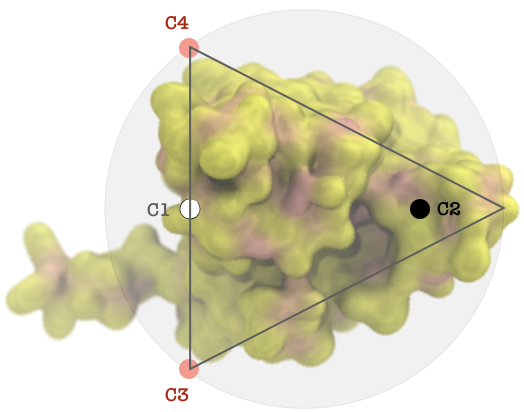
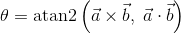

# plumed_residence_time

Calculate the residence time of lipids at a specific region of the protein interface. It uses [PLUMED](https://plumed.github.io) and bash scripts to postprocess a MD trajectory.

## Citation

Please cite the following publication:

G.A. Tribello, M. Bonomi, D. Branduardi, C. Camilloni, G. Bussi, PLUMED2: New feathers for an old bird, Comp. Phys. Comm. 185, 604 (2014)

## Directory Tree

```
/msd_map/
├── plumed.sh
├── Example
    ├── plumed-core.dat  --> plumed input file.
    ├── residence.sh     --> bash script.
    └── COLVAR 		 --> directory
	└── COLVAR1      --> CVs for lipid 1
└── Figure
    ├── gnuplot.plt --> gnuplot script.
    └── Fig1.png    --> diagram of CVs.
```

## PLUMED

### Protein

The file `plumed-core.dat` includes the definition of atoms groups and distance vectors internal to the protein. These CVs will define the position and orientation of the lipid-protein binding interface.
For a in-deep explanation of this file syntax check the PLUMED [manual](https://plumed.github.io/doc-v2.4/user-doc/html/index.html).

```javascript
WHOLEMOLECULES ENTITY0=364,366,367,370,372,806,808,810,813,815,261,268,270,272,694,696,705,706,708,429-432,505-508

c1: CENTER ATOMS=364,366,367,370,372,806,808,810,813,815
c2: CENTER ATOMS=261,268,270,272,694,696,705,706,708
c3: CENTER ATOMS=429-432
c4: CENTER ATOMS=505-508
```
---

The variable `c1` includes the MARTINI BB beads of residues at the dimerization interface of [CLC-ec1](https://www.rcsb.org/structure/1OTS), the protein used in the [Example](./Example) directory. To see in VMD use:

	serial 364 366 367 370 372 806 808 810 813 815

Variable `c2` includes a group of atoms colinear along the *x*-axis with `c1`. The centers of these groups will be used later to define a vector normal to the lipid-protein interface plane. The other two variables indicate the limit of the interface along the *y*-axis. 

<p align="center">
	<br />
	The points, shaded circle, and the triangle should be regarded as diagrammatic,<br /> 
	they do not correspond to the exact location of the atom group centers, for that use VMD.<br /> 
</p>
	
---

```javascript
d12: DISTANCE ATOMS=C2,C1 COMPONENTS
d13: DISTANCE ATOMS=C2,C3 COMPONENTS
d14: DISTANCE ATOMS=C2,C4 COMPONENTS

p1: POSITION ATOM=C2 NOPBC
```
In this part the calculation of the distance vectors from the `c2` center to the other reference points is indicated. The variables ```d12```, ```d13``` and ```d14``` store the *x*, *y*, *z*-components of each vectors as `d12.x`, `d12.y`, etc. These components will be used furhter on to estimate the relative orientation of the lipid molecule to the vector `d12` normal to the lipid-protein surface.

---

The angles between the vector `d12` and vectors `d13` and `d14` are necessary to discriminate among lipid molecules which do not have the proper orientation to be considered binded to the protein interface. To that aim the following formula was used:


<p align="center"></p>


```javascript
MATHEVAL ...
  LABEL=dot3
  ARG=d12.x,d12.y,d13.x,d13.y
  VAR=ax,ay,bx,by
  FUNC=(ax*bx+ay*by)
  PERIODIC=NO
... MATHEVAL

MATHEVAL ...
  LABEL=dot4
  ARG=d12.x,d12.y,d14.x,d14.y
  VAR=ax,ay,bx,by
  FUNC=(ax*bx+ay*by)
  PERIODIC=NO
... MATHEVAL

############

MATHEVAL ...
  LABEL=cross3
  ARG=d12.x,d12.y,d13.x,d13.y
  VAR=ax,ay,bx,by
  FUNC=sqrt((ax*by-ay*bx)*(ax*by-ay*bx))
  PERIODIC=NO
... MATHEVAL

MATHEVAL ...
  LABEL=cross4
  ARG=d12.x,d12.y,d14.x,d14.y
  VAR=ax,ay,bx,by
  FUNC=sqrt((ax*by-ay*bx)*(ax*by-ay*bx))
  PERIODIC=NO
... MATHEVAL
```

`dot3` and `dot4` are the dot products of vector `d12` with `d13`, while `cross3` and `cross4` are the corresponding cross products.

### Protein - Lipid

The file `plumed.sh`
